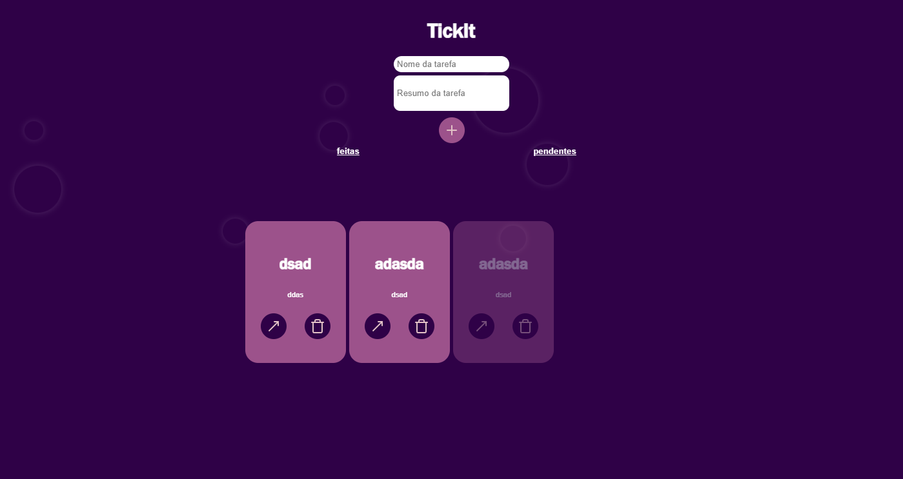

# ✅ TickIt

[](https://nodejs.org/)  [](https://vitejs.dev/)  [](https://www.typescriptlang.org/)  [](https://chatgpt.com/g/g-QNQZOPJ63-readme/c/LICENSE)

O **TickIt** é um **To-Do List moderno** desenvolvido com **boas práticas de front-end**.  
Conta com design responsivo, animações suaves e funcionalidades que tornam a organização de tarefas simples e eficiente.

---

## ✨ Funcionalidades

- **CREATETASK** → Criar novas tarefas que são exibidas em uma lista organizada.
    
- **DELETETASK** → Remover tarefas com um clique no ícone 🗑️.
    
- **TASKFILTER** → Filtrar tarefas entre **pendentes** e **concluídas**.
    
- **SEARCHTASK** → Pesquisar tarefas pelo nome.
    
- **SEEDETAILS** → Exibir mais detalhes de uma tarefa com descrição extensa.
    
- **COMPLETETASK** → Marcar tarefas como concluídas, alterando seu estilo e exibindo ícone de ✔️.
    

---

## 🛠️ Tecnologias Utilizadas

- **TypeScript**
    
- **React com Vite**
    
- **Redux**
    
- **React Router DOM** (com hooks)
    
- **CSS**
    
- **LocalStorage**
    

---

## ▶️ Como Rodar o Projeto

### 🔧 Pré-requisitos

- [Node.js](https://nodejs.org/) v16+
    
- [npm](https://www.npmjs.com/) ou [yarn](https://yarnpkg.com/)
    

### 🚀 Passos

```bash
# Clonar o repositório
git clone https://github.com/Daniel13s/TickIt.git
cd TickIt

# Instalar dependências
npm install
# ou
yarn install

# Rodar aplicação
npm run dev
# ou
yarn dev
```

Após iniciar, acesse no navegador:

```
http://localhost:5173
```

---
## 📷Preview

